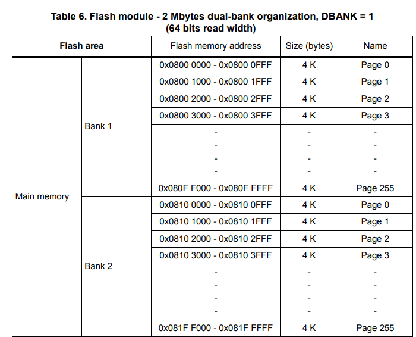
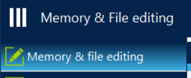
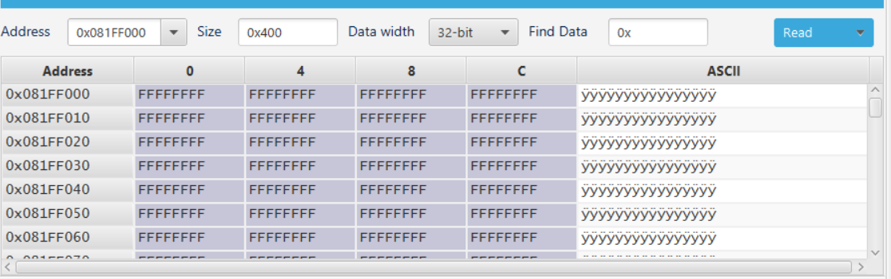
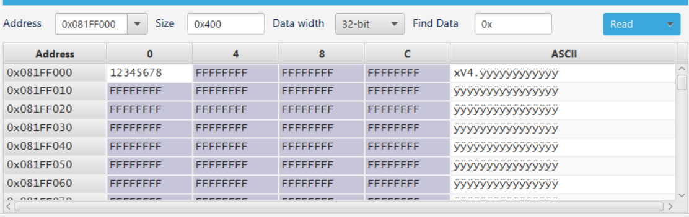
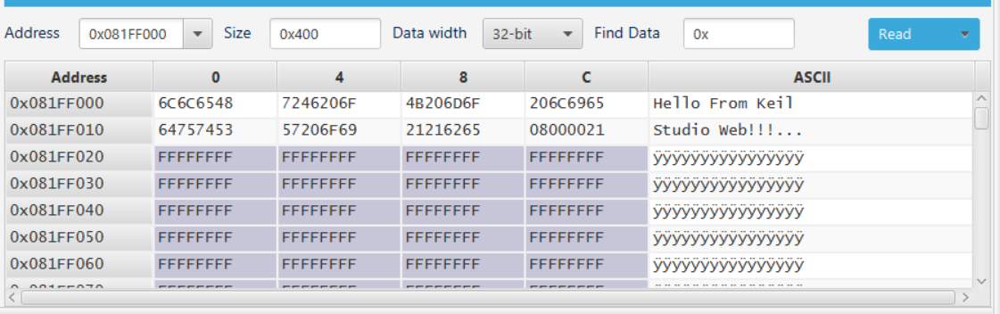

# Using FlashIAP

# Contents
- [Using FlashIAP](#using-flashiap)
- [Contents](#contents)
- [Introduction](#introduction)
	- [What is FlashIAP?](#what-is-flashiap)
	- [Understanding the Flash Memory](#understanding-the-flash-memory)
		- [Writing to Flash](#writing-to-flash)
- [Code](#code)
	- [Erasing Pages](#erasing-pages)
		- [Checking the Erase Function](#checking-the-erase-function)
	- [Write](#write)
		- [Checking the Write Function](#checking-the-write-function)
	- [Read](#read)


# Introduction

This example demonstrates how to use the FlashIAP API to read and write data to the flash memory of an [STM32L4R5ZI Nucleo board](https://www.st.com/en/evaluation-tools/nucleo-l4r5zi.html). The flash is non-volatile memory that is used to store the program code and can be programmed to data that will persist after the device is powered off. This can be particularly useful for storing calibration data or other information that needs to be retained after a power cycle.

## What is FlashIAP?

FlashIAP or Flash in application programming, is an interface that allows the flash memory to be accessed by the application code. Some of the features that FlashIAP provides are:

- Program data into memory
- Read data from memory
- Erase data from memory
- Get page/sector sizes

## Understanding the Flash Memory

Flash memory is described as non-volatile meaning when our device loses power the contents of the flash will not ne lost. This is different to RAM which is volatile meaning when our device loses power the contents of the RAM will be lost.

In an STM32L4R5ZI board we have 2MB flash memory. However this memory is not all available for us to use. When you create a new program and upload it to the board it will be stored in flash memory also, this limits how much flash we can use, but as long as your programs are not extremely large you should be ok.

To understand the structure of the flash we need to look at the data sheet, which can be found [here](https://www.st.com/resource/en/reference_manual/rm0432-stm32l4-series-advanced-armbased-32bit-mcus-stmicroelectronics.pdf). In this we will be able to find a diagram on page 117.



From this diagram we can see that our flash is split into 2 banks each with 256 pages of 4KB each. When we upload a program it is stored from the first page of the first bank and uses as mush space as it needs. To ensure that we do not interfere with our program data we will use the very last page of bank 2.

### Writing to Flash

When you want to program some data to any flash memory we must first erase the page or pages that we will be writing to, this means we will lose any data already written their so we must be careful what pages we choose to erase.

The last thing to mention is that this board has a read width of 64 bits, this means that we must write 64 bits at a time. This is important to remember when we are writing our code.

# Code

## Erasing Pages

As explained above when we want to write to the flash we must first erase the page or pages that we will be writing to. In this example we will be writing to the last page of bank 2, this has an address in memory of `0x081F F000`.

To get started we need to include the `FlashIAP.h` header file.

```cpp
#include <FlashIAP.h>
```

We need to define a function that we will use to write our data to the flash.

```cpp
void FlashData(uint32_t address, uint64_t* data, int numberBytes)
{

}
```

We are passing in the address, data as a pointer and the number of bytes long our data is.

Next we need to create an instance of the `FlashIAP` class.

```cpp
void FlashData(uint32_t address, uint64_t* data, int numberBytes)
{
    FlashIAP flash;
    flash.init();
  
    flash.deinit();
}
```

Now we can get the write width and the page size in bytes. **N.B the method names in FlashIAP are a bit confusing. When this guide refers to page size it is in reference to the [data-sheet](https://www.st.com/resource/en/reference_manual/rm0432-stm32l4-series-advanced-armbased-32bit-mcus-stmicroelectronics.pdf)**

```cpp
void FlashData(uint32_t address, uint64_t* data, int numberBytes)
{
    FlashIAP flash;
    flash.init();

    int writeWidth = flash.get_page_size();
    int pageSize = flash.get_sector_size(address);

    flash.deinit();
}
```

Now we can calculate the number of double words (64 bits) and number of pages we need to write to.

```cpp
void FlashData(uint32_t address, uint64_t* data, int numberBytes)
{
    FlashIAP flash;
    flash.init();

    int writeWidth = flash.get_page_size();
    int pageSize = flash.get_sector_size(address);

    // calculate the number of double words we need
    int numberDoubleWords = (numberBytes / writeWidth) + (numberBytes % writeWidth != 0);

    // calculate number of pages
    int numberPages = (numberBytes / pageSize) + (numberBytes % pageSize != 0);

    flash.deinit();
}
```

Now that we have this we will need to erase the pages we will be writing to.

```cpp
void FlashData(uint32_t address, uint64_t* data, int numberBytes)
{
    FlashIAP flash;
    flash.init();

    int writeWidth = flash.get_page_size();
    int pageSize = flash.get_sector_size(address);

    // calculate the number of double words we need
    int numberDoubleWords = (numberBytes / writeWidth) + (numberBytes % writeWidth != 0);

    // calculate number of pages
    int numberPages = (numberBytes / pageSize) + (numberBytes % pageSize != 0);

     // Erase the number of pages we need to
    flash.erase(address, numberPages * pageSize);

    flash.deinit();
}
```

### Checking the Erase Function

To check the erase function works correctly we will use a program called [STM32CubeProgrammer](https://www.st.com/en/development-tools/stm32cubeprog.html). This allows us to view and edit the contents of the flash memory.

Open the STM32CubeProgrammer and connect your board. Open the `Memory & file editing` section.



Now we can enter an address to view the memory location of. As our data will be stored at `0x081F F000` we will enter this address and press `Read`.



To check if our erase function works correctly we can enter some data here. Simply double click on one of the cells and enter a value in hex.



We can now call the `FlashData` function and check if the data has been erased, for now we can use dummy values for the parameters except the address.

```cpp
FlashData((uint32_t)0x081FF000, 0, 1);
```

After running this we can see that the data has been erased.


## Write

Now that we have erased the pages we want, we can now write to them. Writing involves calling one function, `flash.program()`.

```cpp
void FlashData(uint32_t address, uint64_t* data, int numberBytes)
{
    FlashIAP flash;
    flash.init();

    int writeWidth = flash.get_page_size();
    int pageSize = flash.get_sector_size(address);

    // calculate the number of double words we need
    int numberDoubleWords = (numberBytes / writeWidth) + (numberBytes % writeWidth != 0);

    // calculate number of pages
    int numberPages = (numberBytes / pageSize) + (numberBytes % pageSize != 0);

     // Erase the number of pages we need to
    flash.erase(address, numberPages * pageSize);
    
    // Flash with our data
    flash.program(data, address, numberDoubleWords * writeWidth);

    flash.deinit();
}
```

### Checking the Write Function

To check that our write function works as expected we will use STM32CubeProgrammer again.

To call our function we will need to pass in some data.

```cpp
char data[] = "Hello From Keil Studio Web!!!";
int dataLength = sizeof(data);

FlashData((uint32_t)0x081FF000, (uint64_t*)data, dataLength);
```

Now we can check the memory location again using STM32CubeProgrammer.



## Read

